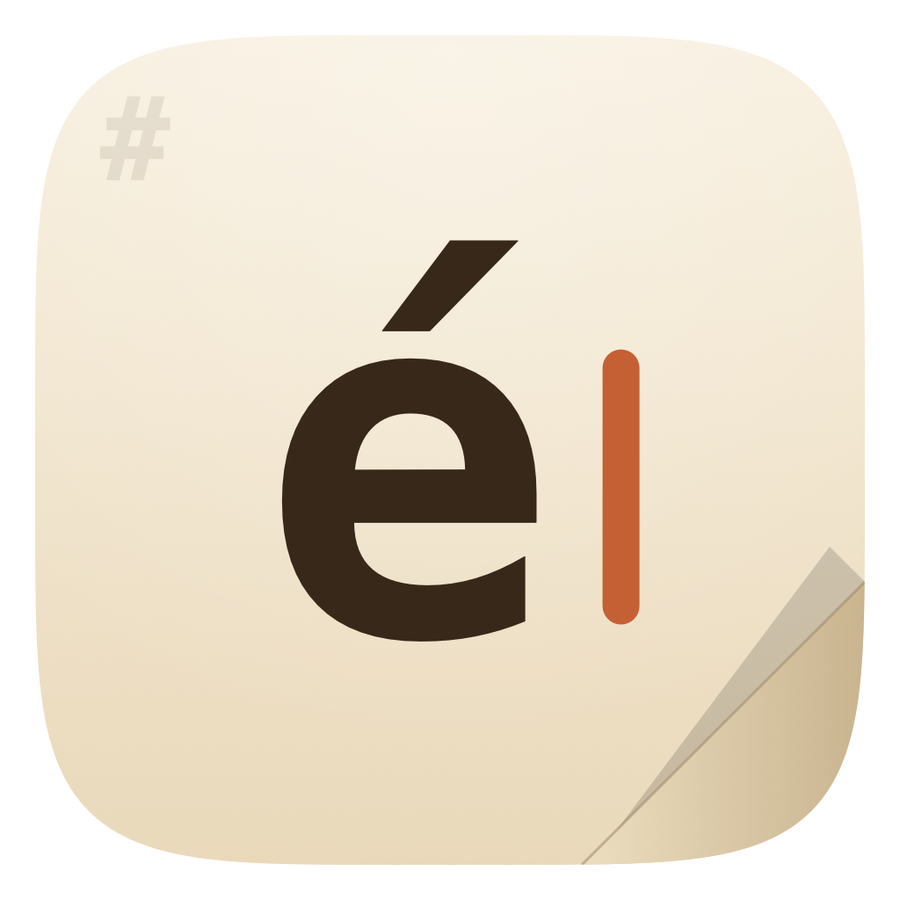
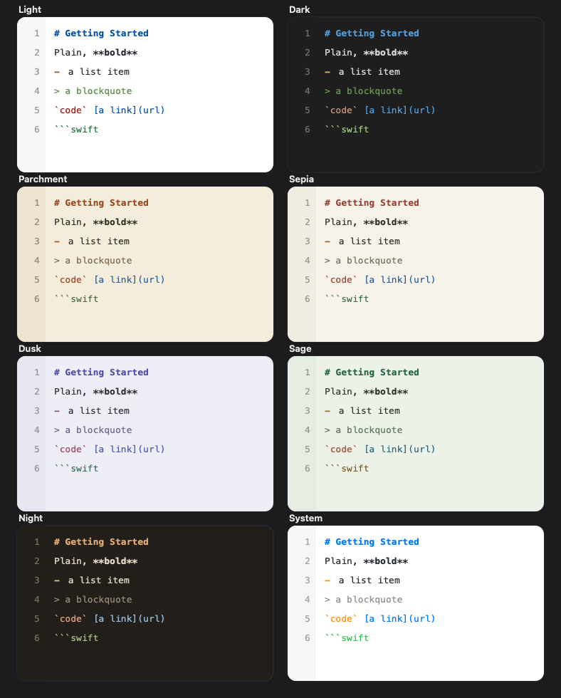

# écri mark down

A lightweight, **native** Markdown editor for macOS (and iOS / iPadOS) that behaves like VS Code — raw source with syntax highlighting and an optional live preview — but **reader‑first**, tiny, and dependency‑free.

It was built to scratch a specific itch: opening `.md` files to *read and review* without launching a heavyweight editor, while keeping authoring one click away when you want it.

- **~2.4 MB** app, **zero** third‑party dependencies, instant launch — no Electron, no Chromium.
- Written in Swift / SwiftUI; one codebase targets macOS, iOS, iPadOS, and visionOS.

## Features

- **Three view modes** — Source, Split, and Preview. Cycle with ⌘⇧P or jump with ⌘1 / ⌘2 / ⌘3; the last mode is remembered.
- **VS Code‑style editor** — monospace, regex syntax highlighting, a line‑number gutter, and a current‑line highlight. Every affordance is individually toggleable, down to an "ultraminimal" plain‑source look.
- **Sticky headings** ("sticky scroll") — the enclosing headings pin to the top as you scroll. Click one to jump to that section, or ⌘‑click / right‑click for an outline of sibling headings.
- **Find & Replace sidebar** — every match shown with its line number and context; click to jump (with a find‑flash). Replace and Replace All are undoable.
- **8 legibility‑tuned themes** — System, Light, Dark, and the paper moods Parchment, Sepia, Dusk, Sage, and Night.
- **Reader‑first** — the default toolbar is just three buttons (view mode, authoring toggle, settings). The authoring toolbar (Bold, Italic, Code, Link, headings, lists, quotes; ⌘B / ⌘I / ⌘E / ⌘K) is off by default and one click to reveal.
- **Live autosave** (toggleable), a multi‑tab **Recents** list, **Finder integration** (double‑click or drag a `.md`/`.txt` to open), and an **unsaved‑changes guard** on close and quit.
- A native **menu bar** with the usual File / Edit / Editor commands and font‑size hotkeys (⌘+ / ⌘− / ⌘0).

## Themes

## Building

Open `écri mark down.xcodeproj` in a recent version of Xcode and Run. The project uses the current SDKs and targets macOS, iOS, iPadOS, and visionOS. It is sandboxed and requires user‑selected file access (granted via the open panel, Finder, or drag‑and‑drop).

There are no package dependencies to fetch — it's plain Swift/SwiftUI.

## Status

A personal project shared in case it's useful to someone. The rendered **preview** handles headings, emphasis, code, quotes, lists, links, tables, images, and task‑list checkboxes. Contributions and issues are welcome.

## License

[MIT](LICENSE) © Jayrom Acorda
